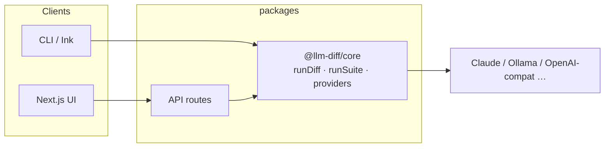

# ModelArena

### *One prompt, many models — compare quality, speed, and cost*

[License: MIT](#license)
[TypeScript](https://www.typescriptlang.org/)
[Next.js](https://nextjs.org/)
[Node](https://nodejs.org/)

**Shipped as the `llm-diff` CLI and a self-hosted Next.js web app.**

```bash
npx llm-diff "Explain the CAP theorem in one paragraph" --models claude,ollama
```

[Demo](docs/demo.gif)

---

## Table of contents

- [Why ModelArena?](#why-modelarena)
- [Features](#features)
- [Quick start](#quick-start)
- [Providers](#providers)
- [Configuration](#configuration)
- [Eval suites (YAML)](#eval-suites-yaml)
- [Web UI](#web-ui)
- [CLI usage](#cli-usage)
- [Architecture](#architecture)
- [Contributing](#contributing)
- [License](#license)

---

## Why ModelArena?

Picking the right model shouldn’t mean juggling tabs, copy-pasting answers, and mentally mapping *which output came from where*. ModelArena runs **one prompt against many models** and lines up **latency, tokens, and cost** so you can decide with evidence—not guesswork.

> [!TIP]
> Use the **CLI** in CI and scripts (`--output json`). Use the **web app** when you want a polished compare view, YAML **test suites**, and **judge-backed rubrics**—without restarting the server when you change models.

---

## Features


|                          |                                                                                                  |
| ------------------------ | ------------------------------------------------------------------------------------------------ |
| **Side-by-side compare** | Same prompt, every enabled model—outputs, errors, and metrics in one grid.                       |
| **YAML eval suites**     | Prompt templates × variable matrices × assertions (`contains`, `latency`, `cost`, `llm-rubric`). |
| **Live suite logs**      | Streamed run log in the web UI so you see each LLM and judge call as it happens.                 |
| **OpenAI model list**    | With an API key, the UI loads chat models from OpenAI’s `/v1/models` (plus presets & “Other”).   |
| **Secrets & judge**      | Web settings for secret variables, Anthropic/Ollama judge, and YAML import/export.               |
| **CLI + core library**   | `npx llm-diff` for terminals; `@llm-diff/core` for programmatic diffs and suites.                |


---

## Quick start

### CLI — zero install

```bash
ANTHROPIC_API_KEY=sk-... npx llm-diff "What is LoRA?"

npx llm-diff "Review this function" --file ./utils.py --models claude,ollama

# Average latency over 5 runs
npx llm-diff "Summarize this" --runs 5 --output json
```

### Web UI — monorepo dev

```bash
git clone https://github.com/darkrishabh/llm-diff
cd llm-diff
npm install
npm run dev
```

Open **[http://localhost:3000](http://localhost:3000)** (or **3001** if 3000 is busy). Add providers under **Settings**—no restart required. **Test suites** live at `**/suite`**.

> [!NOTE]
> Suite streaming and eval need a **Node** deployment (not `output: 'export'`). The suite API sets a long `maxDuration` for hosts like Vercel; very heavy runs may still need a higher limit or a long-lived server.

### Docker

```bash
docker run -p 3000:3000 \
  -e ANTHROPIC_API_KEY=sk-... \
  ghcr.io/darkrishabh/llm-diff
```

---

## Providers

### Cloud APIs


| Provider       | Env var                                | Notes                           |
| -------------- | -------------------------------------- | ------------------------------- |
| **Claude**     | `ANTHROPIC_API_KEY`                    | Haiku, Sonnet, Opus             |
| **OpenAI**     | `OPENAI_API_KEY`                       | Full list in UI when key is set |
| **Groq**       | `GROQ_API_KEY`                         | Very fast inference             |
| **OpenRouter** | `OPENROUTER_API_KEY`                   | Many models, one key            |
| **Together**   | `TOGETHER_API_KEY`                     | Open-weight models              |
| **NVIDIA NIM** | `NVIDIA_NIM_API_KEY`                   | NIM endpoints                   |
| **Perplexity** | `PERPLEXITY_API_KEY`                   | Search-grounded                 |
| **Minimax**    | `MINIMAX_API_KEY` + `MINIMAX_GROUP_ID` | API + group id                  |
| **Custom**     | —                                      | Any OpenAI-compatible base URL  |


### Local & CLI


| Provider       | Requirements                                                             |
| -------------- | ------------------------------------------------------------------------ |
| **Ollama**     | [ollama.ai](https://ollama.ai) — local tags discovered via `/api/models` |
| **Claude CLI** | `@anthropic-ai/claude-code` on `PATH`                                    |
| **Codex CLI**  | `@openai/codex` on `PATH`                                                |
| **LM Studio**  | OpenAI-compatible server (e.g. `localhost:1234`) via **Custom**          |


---

## Configuration

```bash
ANTHROPIC_API_KEY=sk-ant-...
OLLAMA_BASE_URL=http://localhost:11434   # optional

OPENAI_API_KEY=sk-...
GROQ_API_KEY=gsk_...
OPENROUTER_API_KEY=sk-or-...
TOGETHER_API_KEY=...
NVIDIA_NIM_API_KEY=nvapi-...
PERPLEXITY_API_KEY=pplx-...

MINIMAX_API_KEY=...
MINIMAX_GROUP_ID=...
```

Copy `**.env.example**` to `**.env.local**` for the web app, or export vars in your shell for the CLI.

---

## Eval suites (YAML)

Define **prompt templates**, **test rows** (`vars`), and **assertions**: `contains`, `not-contains`, `latency`, `cost`, and `**llm-rubric`** (needs a **judge**—Claude when a key is available, or `--judge ollama` / `none`).

Full example: `[examples/llm-diff.yaml](examples/llm-diff.yaml)`

```bash
llm-diff run --config examples/llm-diff.yaml --models claude,ollama,minimax
llm-diff run --config examples/llm-diff.yaml --output json --fail-on-error
llm-diff run --config examples/llm-diff.yaml --judge none
```

The web app runs the same engine at `**POST /api/suite**` with **SSE live logs** when `stream: true`.

---

## Web UI


| Capability           | Description                                                                                                                                         |
| -------------------- | --------------------------------------------------------------------------------------------------------------------------------------------------- |
| **Run workspace**    | Prompt card, colored model chips, **+ add model**, **Run**, then **Responses / Compare & evaluate / History**                                       |
| **Responses**        | **Grid** (wrapping cards, 4+ models), **Side-by-side** (horizontal scroll), or **Diff** (line-level LCS between two outputs)                        |
| **Model cards**      | Provider label, model id, highlight pills (e.g. fastest / slowest / cheapest / best rated), 3-column metrics, markdown body, star rating + **Copy** |
| **Quick comparison** | Sticky footer mini-bars for latency, output tokens, and cost; **Full compare** jumps to the evaluate tab                                            |
| **History**          | Last runs stored in `localStorage`; click an entry to reload prompt + results                                                                       |
| **Test suites**      | `/suite` — YAML editor, run target banner, judge summary, live log, matrix results, recent runs (last 15, browser `localStorage`)                      |
| **Settings**         | Models, secrets, judge, YAML import/export — stored in `localStorage`                                                                               |
| **API routes**       | `/api/diff`, `/api/suite`, `/api/models` (Ollama GET, OpenAI POST)                                                                                  |


### Design concept (ModelArena UI)

The web shell follows a **light editorial** layout: flat **canvas** `#f9f9f9`, **white** cards with soft hairline borders and restrained shadows, and **Inter** for UI copy with **monospace** for model ids and metrics.

- **Primary actions** use a saturated blue (`--accent`, ~`#2563eb`): **Run** and **+ New run** are filled; secondary actions (**Test suites**, **Settings**, **+ add model**) stay neutral outlines or dashed chips.
- **Model chips** in the prompt bar use a **fixed ordinal palette** (green → blue → orange → purple → …) so each slot reads distinctly, independent of provider brand color. Full provider context remains on hover (`title`) and on each response card.
- **Tabs** use a **dark underline** on the active item; **Responses** view mode is a **segmented control** (Grid / Side-by-side / Diff). The run summary pill shows **succeeded count**, **clock time**, and **wall-clock-style total** (max latency across successful models, as a proxy for parallel runs).
- **Response grid** prefers **two-up columns** on a wide main column (`minmax(~500px, 1fr)`) so four models read as a **2×2** board; narrower viewports collapse to one column.
- **Markdown code** blocks use a **warm paper** background (`--code-bg`) and a slightly stronger border (`--code-border`) so code reads as a distinct panel inside the card.
- **Semantic color**: green for fast / free, red for slow or failed, amber for paid cost; superlative **pills** map to the same system (e.g. fastest = green tint, slowest = red tint).
- **Quick comparison** bars are **metric-tinted** (latency green, output tokens violet, cost amber/brown) rather than per-provider hues, with a small **down-arrow** cue on latency (lower is better). **Full compare** uses an **↗** affordance to match “open evaluate tab.”
- **Ratings** use **thin-stroke star** icons (outline empty, filled when selected) for a minimal icon style consistent with the rest of the chrome.

Design tokens live in `packages/web/src/app/globals.css`; chip ordinals are `MODEL_CHIP_PALETTE` in `packages/web/src/lib/model-chip-palette.ts`.

### Design concept (ModelArena v0.1)

The home screen is a **single-run arena**: one prompt at the top, enabled models as **tags**, then a **tabbed** workspace for raw responses, structured comparison, or **history**. After a run, a **toolbar** shows success counts and time, plus a **segmented control** (Grid / Side-by-side / Diff) so you can choose density and comparison style without leaving the tab.

**Grid** uses a responsive `auto-fill` layout so four or more models wrap naturally (e.g. 2×2 on a typical desktop). **Side-by-side** favors wide outputs with horizontal scroll. **Diff** picks a **baseline** and **compare** model and renders a **line-level** diff (green = only in compare, red = only in baseline).

Each **response card** is self-contained: semantic coloring on latency and cost, a **footer** with an optional **1–5 star** rating (stored in `sessionStorage` for “best rated” highlights) and **copy-to-clipboard**. The **quick comparison** strip anchors the quantitative story—small multiples of the same metrics—while **Compare & evaluate** keeps deeper analysis (similarity, structure, cost bars) on the second tab.

---

## CLI usage

```
Usage: llm-diff <prompt> [options]

Arguments:
  prompt                     Prompt to send to all providers

Options:
  --file <path>              Append file contents to the prompt
  --models <list>            Comma-separated providers (default: "claude,ollama")
  --runs <n>                 Runs for latency averaging (default: 1)
  --output <format>          pretty | json (default: "pretty")
  -V, --version              Show version
  -h, --help                 Show help
```

```bash
llm-diff "Implement binary search in Python" --models claude,ollama
llm-diff "Hello" --models groq,claude --runs 10 --output json | jq '.results[].latencyMs'
llm-diff "Find bugs" --file ./server.ts
llm-diff "Explain recursion" --models claude-cli,codex
```

---

## Architecture




| Package             | Role                                                               |
| ------------------- | ------------------------------------------------------------------ |
| `**packages/core**` | `Provider` interface, `runDiff`, `runSuite`, YAML parsing, pricing |
| `**packages/cli**`  | Commander + terminal UI                                            |
| `**packages/web**`  | Next.js App Router, streaming suite API, model discovery proxy     |


**Adding a provider** is on the order of tens of lines: implement `Provider` in core and wire it in the web API (and CLI config if needed). `OpenAICompatibleProvider` covers most REST APIs; subprocess adapters cover local CLIs.

---

## Contributing

```bash
git clone https://github.com/darkrishabh/llm-diff
cd llm-diff
npm install
npm run dev          # turbo: CLI watch + Next dev
npm run build
npm run type-check
```

Ideas that move the needle: new providers (Gemini, Bedrock, Azure OpenAI), richer diff UX, terminal markdown, tighter CI eval stories.

---

## License

MIT