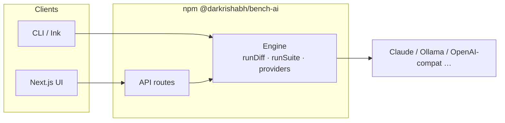

<div align="center">


<br />
<br />

<h1>Bench AI</h1>

<p>One prompt, many models — compare quality, speed, and cost.</p>

<br />

[](https://www.npmjs.com/package/@darkrishabh/bench-ai)
[](./LICENSE)
[](https://nodejs.org)
[](https://bench-ai-web.vercel.app/)
[](https://github.com/darkrishabh/bench-ai)

<br />

[**Live demo →**](https://bench-ai-web.vercel.app/) &nbsp;·&nbsp; [Quick start](#quick-start) &nbsp;·&nbsp; [Web UI](#web-ui) &nbsp;·&nbsp; [CLI](#cli-usage) &nbsp;·&nbsp; [Providers](#providers) &nbsp;·&nbsp; [Eval suites](#eval-suites-yaml) &nbsp;·&nbsp; [Architecture](#architecture)

</div>

---

**Bench AI** runs **one prompt against many LLMs** and lines up answers, latency, tokens, and cost in a single npm package: a **CLI** (binary **`bench-ai`**), a **Next.js web UI** (`bench-ai web`), and a **programmatic API** (`import { … } from "@darkrishabh/bench-ai"`).

```bash
npx @darkrishabh/bench-ai "Explain the CAP theorem in one paragraph" --models claude,ollama
```

Works on **macOS**, **Linux**, and **Windows** with **Node.js 18+**.

---

## Table of contents

- [Why Bench AI?](#why-bench-ai)
- [Features](#features)
- [Quick start](#quick-start)
- [Providers](#providers)
- [Configuration](#configuration)
- [Eval suites (YAML)](#eval-suites-yaml)
- [Web UI](#web-ui)
- [CLI usage](#cli-usage)
- [Architecture](#architecture)
- [Contributing](#contributing)
- [License](#license)

---

## Why Bench AI?

Picking the right model shouldn't mean mentally mapping *which output came from where*. Bench AI keeps every model's answer and metrics in one place so you can decide with data.

> **Tip:** Use the **CLI** in CI and scripts (`--output json`). Use **`bench-ai web`** or the **hosted app** when you want a polished compare view, YAML test suites, and judge-backed rubrics — without restarting the server when you change models.

---

## Features

| | |
|---|---|
| **Side-by-side compare** | Same prompt, every enabled model — outputs, errors, and metrics in one grid. |
| **YAML eval suites** | Prompt templates × variable matrices × assertions (`contains`, `latency`, `cost`, `llm-rubric`). |
| **Live suite logs** | Streamed run log in the web UI so you see each LLM and judge call as it happens. |
| **OpenAI model list** | With an API key, the UI loads chat models from OpenAI's `/v1/models` (plus presets & "Other"). |
| **Secrets & judge** | Web settings for secret variables, Anthropic/Ollama judge, and YAML import/export. |
| **One package** | `npx @darkrishabh/bench-ai`, `npm i -g @darkrishabh/bench-ai`, `bench-ai web`, and `import … from "@darkrishabh/bench-ai"`. |

---

## Quick start

### CLI — zero install

```bash
ANTHROPIC_API_KEY=sk-... npx @darkrishabh/bench-ai "What is LoRA?"

npx @darkrishabh/bench-ai "Review this function" --file ./utils.py --models claude,ollama

# Average latency over 5 runs
npx @darkrishabh/bench-ai "Summarize this" --runs 5 --output json
```

The npm package is **scoped** as **`@darkrishabh/bench-ai`** because unscoped **`bench-ai`** is taken by another project and unscoped **`bench-ai`** is blocked as too similar. After **`npm i -g @darkrishabh/bench-ai`**, the CLI is **`bench-ai`** / **`bench-ai web`**.

### Web UI — hosted

Open [**https://bench-ai-web.vercel.app/**](https://bench-ai-web.vercel.app/). Add API keys under **Settings** in the browser; test suites live at `/suite`.

### Web UI — local dev

```bash
git clone https://github.com/darkrishabh/bench-ai
cd bench-ai
npm install
npm run dev
```

Then open [http://localhost:3000](http://localhost:3000) (or `3001` if 3000 is busy).

From a global or local install you can also run:

```bash
bench-ai web
```

> **Note:** Suite streaming and eval need a Node deployment (not `output: 'export'`). The suite API sets a long `maxDuration` for hosts like Vercel; very heavy runs may still need a higher limit or a long-lived server.

### Deploying on Vercel

1. **Root Directory** → `.` (repository root), or leave empty if the Vercel project is linked to this repo only.
2. **Build Command** → leave empty (uses root `vercel.json`: `npm run build`) or set explicitly to `npm run build`.
3. **Install** → default `npm install` at the repo root.

`next.config.ts` sets `outputFileTracingRoot` to the project root for correct serverless file tracing.

---

## Providers

### Cloud APIs

| Provider | Env var | Notes |
|---|---|---|
| **Claude** | `ANTHROPIC_API_KEY` | Haiku, Sonnet, Opus |
| **OpenAI** | `OPENAI_API_KEY` | Full list in UI when key is set |
| **Groq** | `GROQ_API_KEY` | Very fast inference |
| **OpenRouter** | `OPENROUTER_API_KEY` | Many models, one key |
| **Together** | `TOGETHER_API_KEY` | Open-weight models |
| **NVIDIA NIM** | `NVIDIA_NIM_API_KEY` | NIM endpoints |
| **Perplexity** | `PERPLEXITY_API_KEY` | Search-grounded |
| **Minimax** | `MINIMAX_API_KEY` + `MINIMAX_GROUP_ID` | API + group ID |
| **Custom** | — | Any OpenAI-compatible base URL |

### Local & CLI

| Provider | Requirements |
|---|---|
| **Ollama** | [ollama.ai](https://ollama.ai) — local tags discovered via `/api/models` |
| **Claude CLI** | `@anthropic-ai/claude-code` on `PATH` |
| **Codex CLI** | `@openai/codex` on `PATH` |
| **LM Studio** | OpenAI-compatible server (e.g. `localhost:1234`) via **Custom** |

---

## Configuration

Copy `.env.example` to `.env.local` for the web app, or export vars in your shell for the CLI.

```bash
ANTHROPIC_API_KEY=sk-ant-...
OLLAMA_BASE_URL=http://localhost:11434   # optional

OPENAI_API_KEY=sk-...
GROQ_API_KEY=gsk_...
OPENROUTER_API_KEY=sk-or-...
TOGETHER_API_KEY=...
NVIDIA_NIM_API_KEY=nvapi-...
PERPLEXITY_API_KEY=pplx-...

MINIMAX_API_KEY=...
MINIMAX_GROUP_ID=...
```

---

## Eval suites (YAML)

Define prompt templates, test rows (`vars`), and assertions: `contains`, `not-contains`, `latency`, `cost`, and `llm-rubric` (needs a judge — Claude when a key is available, or `--judge ollama` / `none`).

Full example: [`examples/bench-ai.yaml`](examples/bench-ai.yaml)

```bash
npx @darkrishabh/bench-ai run --config examples/bench-ai.yaml --models claude,ollama,minimax
npx @darkrishabh/bench-ai run --config examples/bench-ai.yaml --output json --fail-on-error
npx @darkrishabh/bench-ai run --config examples/bench-ai.yaml --judge none
```

With a global install (`npm i -g @darkrishabh/bench-ai`), use **`bench-ai run --config …`** instead of **`npx @darkrishabh/bench-ai`**.

The web app runs the same engine at `POST /api/suite` with SSE live logs when `stream: true`.

---

## Web UI

<div align="center">

</div>

<br />

| Capability | Description |
|---|---|
| **Run workspace** | Prompt card, colored model chips, **+ add model**, **Run**, then **Responses / Compare & evaluate / History** |
| **Responses** | **Grid** (wrapping cards, 4+ models), **Side-by-side** (horizontal scroll), or **Diff** (line-level LCS between two outputs) |
| **Model cards** | Provider label, model ID, highlight pills (fastest / slowest / cheapest / best rated), 3-column metrics, markdown body, star rating + **Copy** |
| **Quick comparison** | Sticky footer mini-bars for latency, output tokens, and cost; **Full compare** jumps to the evaluate tab |
| **History** | Last runs stored in `localStorage`; click an entry to reload prompt + results |
| **Test suites** | `/suite` — YAML editor, run target banner, judge summary, live log, matrix results, recent runs (last 15, browser `localStorage`) |
| **Settings** | Models, secrets, judge, YAML import/export — stored in `localStorage` |
| **API routes** | `/api/diff`, `/api/suite`, `/api/models` (Ollama GET, OpenAI POST) |

---

## CLI usage

The binary name is **`bench-ai`**. Use **`npx @darkrishabh/bench-ai …`** for one-off runs, or **`npm i -g @darkrishabh/bench-ai`** and then **`bench-ai …`**.

Top-level: **`bench-ai --help`** — commands are **`diff`** (default), **`run`**, and **`web`**.

### `diff` — one prompt across providers

You can omit **`diff`**; it is the default command.

```
Usage: bench-ai diff [options] [prompt]

Arguments:
  prompt                     Prompt to send to all providers

Options:
  --file <path>              Append file contents to the prompt
  --models <list>            Comma-separated providers (default: "claude,ollama")
  --runs <n>                 Runs for latency averaging (default: 1)
  --output <format>          pretty | json (default: "pretty")
  -h, --help                 Show help for this command
```

Program options: **`-V` / `--version`**, **`-h` / `--help`** (when no subcommand).

```bash
bench-ai "Implement binary search in Python" --models claude,ollama
bench-ai diff "Hello" --models groq,claude --runs 10 --output json | jq '.results[].latencyMs'
bench-ai "Find bugs" --file ./server.ts
bench-ai "Explain recursion" --models claude-cli,codex
```

### `run` — YAML eval suite

```
Usage: bench-ai run [options]

Options:
  --config <path>            Path to suite YAML (required)
  --models <list>            Comma-separated providers (default: "claude,ollama")
  --output <format>            pretty | json (default: "pretty")
  --verbose                    Per-case assertion details and full prompts
  --fail-on-error            Exit 1 if any provider result fails
  --judge <name>             llm-rubric judge: auto | claude | ollama | none (default: "auto")
  -h, --help                 Show help
```

Use **`npx @darkrishabh/bench-ai run …`** when the CLI is not installed globally.

### `web` — local Next.js UI

```
Usage: bench-ai web [options]

Options:
  -p, --port <port>          Port to listen on (default: "3000")
  -h, --help                 Show help
```

Starts the Next.js dev server from the **`@darkrishabh/bench-ai`** package directory (works with **`npx @darkrishabh/bench-ai`** and global installs).

---

## Architecture

This repository is **one npm package at the root** (`@darkrishabh/bench-ai`): no workspaces or `packages/` split. Use **`npm install`** / **`npm run dev`** / **`npm run build`** from the clone root.



| Area | Role |
|---|---|
| **This repo** (npm **`@darkrishabh/bench-ai`**) | Engine (`src/engine`), CLI (`src/cli`, binary **`bench-ai`**), Next.js app (`src/app`, `src/components`, …) |
| **`bench-ai web`** | Runs `next dev` with cwd at the installed package root |

**Adding a provider** is on the order of tens of lines: implement `Provider` in the engine and wire it in the web API (and CLI config if needed). `OpenAICompatibleProvider` covers most REST APIs; subprocess adapters cover local CLIs.

---

## Contributing

```bash
git clone https://github.com/darkrishabh/bench-ai.git
cd bench-ai
npm install
npm run dev          # engine watch + Next dev
npm run build
npm run type-check
```

If your local `origin` still uses the old repository name:

```bash
git remote set-url origin https://github.com/darkrishabh/bench-ai.git
```

Ideas that move the needle: new providers (Gemini, Bedrock, Azure OpenAI), richer diff UX, terminal markdown, tighter CI eval stories.

---

## License

MIT — see [LICENSE](./LICENSE).

<div align="center">
<br />
<sub>Built by <a href="https://github.com/darkrishabh">@darkrishabh</a></sub>
</div>
