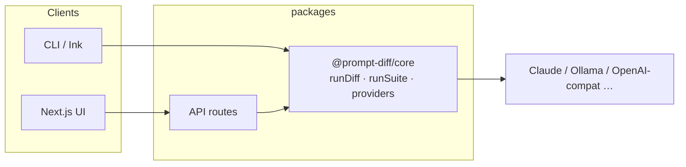

# Prompt-Diff

### *One prompt, many models — compare quality, speed, and cost*

**Run one prompt against many LLMs** — compare answers, latency, tokens, and cost in the **CLI** (`prompt-diff`) or the **Next.js** web UI.

[License: MIT](#license)
[TypeScript](https://www.typescriptlang.org/)
[Next.js](https://nextjs.org/)
[Node](https://nodejs.org/)

**Shipped as the `prompt-diff` npm CLI and a self-hosted Next.js web app.**

**Live web UI:** [prompt-diff.vercel.app](https://prompt-diff.vercel.app/) · **CLI:** `npx prompt-diff`

```bash
npx prompt-diff "Explain the CAP theorem in one paragraph" --models claude,ollama
```

[Demo](docs/demo.gif)

---

## Table of contents

- [Why Prompt-Diff?](#why-prompt-diff)
- [Features](#features)
- [Quick start](#quick-start)
- [Providers](#providers)
- [Configuration](#configuration)
- [Eval suites (YAML)](#eval-suites-yaml)
- [Web UI](#web-ui)
- [CLI usage](#cli-usage)
- [Architecture](#architecture)
- [Contributing](#contributing)
- [License](#license)

---

## Why Prompt-Diff?

Picking the right model shouldn’t mean juggling tabs, copy-pasting answers, and mentally mapping *which output came from where*. **Prompt-Diff** runs **one prompt against many models** and lines up **latency, tokens, and cost** so you can decide with evidence—not guesswork.

> [!TIP]
> Use the **CLI** in CI and scripts (`--output json`). Use the **web app** when you want a polished compare view, YAML **test suites**, and **judge-backed rubrics**—without restarting the server when you change models.

---

## Features


|                          |                                                                                                  |
| ------------------------ | ------------------------------------------------------------------------------------------------ |
| **Side-by-side compare** | Same prompt, every enabled model—outputs, errors, and metrics in one grid.                       |
| **YAML eval suites**     | Prompt templates × variable matrices × assertions (`contains`, `latency`, `cost`, `llm-rubric`). |
| **Live suite logs**      | Streamed run log in the web UI so you see each LLM and judge call as it happens.                 |
| **OpenAI model list**    | With an API key, the UI loads chat models from OpenAI’s `/v1/models` (plus presets & “Other”).   |
| **Secrets & judge**      | Web settings for secret variables, Anthropic/Ollama judge, and YAML import/export.               |
| **CLI + core library**   | `npx prompt-diff` for terminals; `@prompt-diff/core` for programmatic diffs and suites.          |


---

## Quick start

### CLI — zero install

```bash
ANTHROPIC_API_KEY=sk-... npx prompt-diff "What is LoRA?"

npx prompt-diff "Review this function" --file ./utils.py --models claude,ollama

# Average latency over 5 runs
npx prompt-diff "Summarize this" --runs 5 --output json
```

### Web UI — hosted

Open **[https://prompt-diff.vercel.app/](https://prompt-diff.vercel.app/)**. Add API keys under **Settings** in the browser; **Test suites** are at `**/suite`**.

### Web UI — local dev

```bash
git clone https://github.com/darkrishabh/prompt-diff
cd prompt-diff
npm install
npm run dev
```

Then open **[http://localhost:3000](http://localhost:3000)** (or **3001** if 3000 is busy). Same **Settings** and `**/suite`** flow as production.

> [!NOTE]
> Suite streaming and eval need a **Node** deployment (not `output: 'export'`). The suite API sets a long `maxDuration` for hosts like Vercel; very heavy runs may still need a higher limit or a long-lived server.

**Deploying on Vercel (this monorepo)** — required or you get a plain `**NOT_FOUND`** on `*.vercel.app`:

1. **Project → Settings → General → Root Directory:** set to `**packages/web`** (not `.` and not empty). If this points at the repo root, Vercel never sees `**packages/web/.next**` as the Next.js app and the deployment will not serve routes.
2. **Build Command:** leave **empty** (uses `packages/web/vercel.json`: `**npm run build`**) or set explicitly to `**npm run build**`. Do **not** use `**next build` only** — it skips compiling `**@prompt-diff/core`** (`dist/` is required for `import "@prompt-diff/core"`).
3. **Install:** default `**npm install`** from the **repository root** (where `package-lock.json` lives) is correct for npm workspaces.
4. **Include files outside Root Directory:** leave **enabled** (Vercel default) so `**packages/core`** is visible during the build.

`packages/web/next.config.ts` sets `**outputFileTracingRoot**` to the monorepo root so API routes bundle correctly. **Production:** [prompt-diff.vercel.app](https://prompt-diff.vercel.app/).

### Docker

```bash
docker run -p 3000:3000 \
  -e ANTHROPIC_API_KEY=sk-... \
  ghcr.io/darkrishabh/prompt-diff
```

---

## Providers

### Cloud APIs


| Provider       | Env var                                | Notes                           |
| -------------- | -------------------------------------- | ------------------------------- |
| **Claude**     | `ANTHROPIC_API_KEY`                    | Haiku, Sonnet, Opus             |
| **OpenAI**     | `OPENAI_API_KEY`                       | Full list in UI when key is set |
| **Groq**       | `GROQ_API_KEY`                         | Very fast inference             |
| **OpenRouter** | `OPENROUTER_API_KEY`                   | Many models, one key            |
| **Together**   | `TOGETHER_API_KEY`                     | Open-weight models              |
| **NVIDIA NIM** | `NVIDIA_NIM_API_KEY`                   | NIM endpoints                   |
| **Perplexity** | `PERPLEXITY_API_KEY`                   | Search-grounded                 |
| **Minimax**    | `MINIMAX_API_KEY` + `MINIMAX_GROUP_ID` | API + group id                  |
| **Custom**     | —                                      | Any OpenAI-compatible base URL  |


### Local & CLI


| Provider       | Requirements                                                             |
| -------------- | ------------------------------------------------------------------------ |
| **Ollama**     | [ollama.ai](https://ollama.ai) — local tags discovered via `/api/models` |
| **Claude CLI** | `@anthropic-ai/claude-code` on `PATH`                                    |
| **Codex CLI**  | `@openai/codex` on `PATH`                                                |
| **LM Studio**  | OpenAI-compatible server (e.g. `localhost:1234`) via **Custom**          |


---

## Configuration

```bash
ANTHROPIC_API_KEY=sk-ant-...
OLLAMA_BASE_URL=http://localhost:11434   # optional

OPENAI_API_KEY=sk-...
GROQ_API_KEY=gsk_...
OPENROUTER_API_KEY=sk-or-...
TOGETHER_API_KEY=...
NVIDIA_NIM_API_KEY=nvapi-...
PERPLEXITY_API_KEY=pplx-...

MINIMAX_API_KEY=...
MINIMAX_GROUP_ID=...
```

Copy `**.env.example**` to `**.env.local**` for the web app, or export vars in your shell for the CLI.

---

## Eval suites (YAML)

Define **prompt templates**, **test rows** (`vars`), and **assertions**: `contains`, `not-contains`, `latency`, `cost`, and `**llm-rubric`** (needs a **judge**—Claude when a key is available, or `--judge ollama` / `none`).

Full example: `[examples/prompt-diff.yaml](examples/prompt-diff.yaml)`

```bash
prompt-diff run --config examples/prompt-diff.yaml --models claude,ollama,minimax
prompt-diff run --config examples/prompt-diff.yaml --output json --fail-on-error
prompt-diff run --config examples/prompt-diff.yaml --judge none
```

The web app runs the same engine at `**POST /api/suite**` with **SSE live logs** when `stream: true`.

---

## Web UI


| Capability           | Description                                                                                                                                         |
| -------------------- | --------------------------------------------------------------------------------------------------------------------------------------------------- |
| **Run workspace**    | Prompt card, colored model chips, **+ add model**, **Run**, then **Responses / Compare & evaluate / History**                                       |
| **Responses**        | **Grid** (wrapping cards, 4+ models), **Side-by-side** (horizontal scroll), or **Diff** (line-level LCS between two outputs)                        |
| **Model cards**      | Provider label, model id, highlight pills (e.g. fastest / slowest / cheapest / best rated), 3-column metrics, markdown body, star rating + **Copy** |
| **Quick comparison** | Sticky footer mini-bars for latency, output tokens, and cost; **Full compare** jumps to the evaluate tab                                            |
| **History**          | Last runs stored in `localStorage`; click an entry to reload prompt + results                                                                       |
| **Test suites**      | `/suite` — YAML editor, run target banner, judge summary, live log, matrix results, recent runs (last 15, browser `localStorage`)                   |
| **Settings**         | Models, secrets, judge, YAML import/export — stored in `localStorage`                                                                               |
| **API routes**       | `/api/diff`, `/api/suite`, `/api/models` (Ollama GET, OpenAI POST)                                                                                  |

---

## CLI usage

```
Usage: prompt-diff <prompt> [options]

Arguments:
  prompt                     Prompt to send to all providers

Options:
  --file <path>              Append file contents to the prompt
  --models <list>            Comma-separated providers (default: "claude,ollama")
  --runs <n>                 Runs for latency averaging (default: 1)
  --output <format>          pretty | json (default: "pretty")
  -V, --version              Show version
  -h, --help                 Show help
```

```bash
prompt-diff "Implement binary search in Python" --models claude,ollama
prompt-diff "Hello" --models groq,claude --runs 10 --output json | jq '.results[].latencyMs'
prompt-diff "Find bugs" --file ./server.ts
prompt-diff "Explain recursion" --models claude-cli,codex
```

---

## Architecture




| Package             | Role                                                               |
| ------------------- | ------------------------------------------------------------------ |
| `**packages/core**` | `Provider` interface, `runDiff`, `runSuite`, YAML parsing, pricing |
| `**packages/cli**`  | Commander + terminal UI                                            |
| `**packages/web**`  | Next.js App Router, streaming suite API, model discovery proxy     |


**Adding a provider** is on the order of tens of lines: implement `Provider` in core and wire it in the web API (and CLI config if needed). `OpenAICompatibleProvider` covers most REST APIs; subprocess adapters cover local CLIs.

---

## Contributing

Source: **[github.com/darkrishabh/prompt-diff](https://github.com/darkrishabh/prompt-diff)**

```bash
git clone https://github.com/darkrishabh/prompt-diff.git
cd prompt-diff
npm install
npm run dev          # turbo: CLI watch + Next dev
npm run build
npm run type-check
```

If your local `origin` still uses the old repository name, point it at the canonical URL:

```bash
git remote set-url origin https://github.com/darkrishabh/prompt-diff.git
```

For **GHCR / Docker**, use **`ghcr.io/darkrishabh/prompt-diff`** (rebuild and push if you still have images tagged with **`llm-diff`**).

Ideas that move the needle: new providers (Gemini, Bedrock, Azure OpenAI), richer diff UX, terminal markdown, tighter CI eval stories.

---

## License

MIT